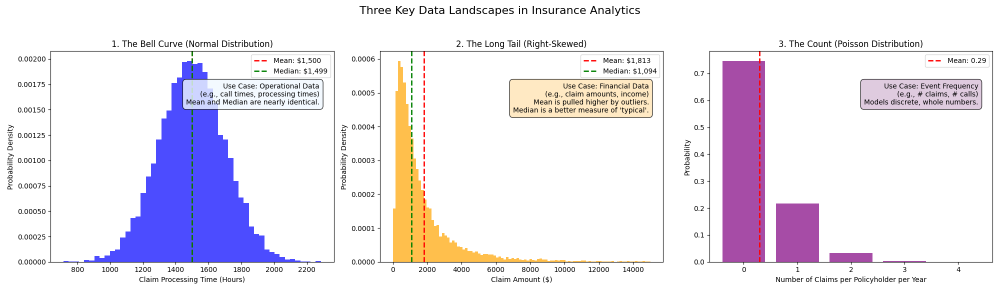

# A Practical Journey into Insurance Data Analytics

This repository documents a learning journey from the high-level business concepts of insurance analytics to the practical, hands-on application of statistical modeling and data visualization. We explore _why_ data is critical in the insurance industry and _how_ to use it to generate actionable insights.

---

## Part 1: The Business Context - Why Analytics?

Our journey began with understanding the fundamental role of analytics in the insurance value chain. Based on the "Insurance Analytics" presentation, we established that analytics helps both insurers and customers navigate uncertainty.

Key takeaways include:

- **The Core Data Cycle:** Data informs risk assessment, which informs pricing. Premiums are collected, claims are paid, and this entire process generates more data, creating a continuous learning loop.
- **The Four Types of Analytics:**
  1.  **Descriptive:** What happened? (e.g., summarizing past claims)
  2.  **Diagnostic:** Why did it happen? (e.g., finding the root cause of high claims in a region)
  3.  **Predictive:** What will likely happen? (e.g., forecasting future claims)
  4.  **Prescriptive:** What should we do? (e.g., recommending specific actions based on predictions)

---

## Part 2: The Statistical Foundation - Reading the Data Landscape

Before building any models, we must first understand the nature of our data. This involves visualizing the shape, or **distribution**, of our key variables. This is the crucial first step of any serious analysis.

We explored three common data "landscapes" found in insurance data:

1.  **The Bell Curve (Normal Distribution):** Represents predictable, stable processes (e.g., operational timers).
2.  **The Long Tail (Right-Skewed Distribution):** The most critical for financial data. It shows that most claims are small, but a few catastrophic claims (outliers) can dramatically pull up the average. This highlights the importance of using the **median** as a measure of a "typical" value.
3.  **The Count (Poisson Distribution):** Used to model the _frequency_ of events, such as the number of claims a policyholder files in a year.

### Visualization

We generated the following plot to visualize these concepts using `matplotlib` and `scipy`:



This plot clearly illustrates the difference between the distributions and highlights the critical gap between the **mean** and **median** in skewed data.

---

## Part 3: Asking Questions and Building Models (Current Work)

With a solid understanding of our data's shape, we are now moving into the next phase:

- **Hypothesis Testing:** Using statistical tests (like the t-test, ANOVA, and Chi-Squared test) to ask specific, data-driven questions and distinguish real effects from random chance.
- **Statistical & Machine Learning Modeling:** Building predictive models to forecast outcomes, such as identifying high-risk vs. low-risk customers. This involves crucial steps like data preparation, feature engineering, and model evaluation.

---

## How to Run This Project

1.  **Setup a Virtual Environment:**

    ```bash
    python3 -m venv .venv
    ```

2.  **Install Dependencies:**

    ```bash
    .venv/bin/pip install pdfplumber numpy matplotlib scipy
    ```

3.  **Generate the Visualization:**
    To regenerate the `distributions_plot.png` image, run the following command:
    ```bash
    .venv/bin/python generate_plots.py
    ```

<details>
<summary>📊 Click to view EDA Report</summary>
<br>


_Interactive version: [Open Full Report](https://abubogale342.github.io/week-three/)_

</details>
